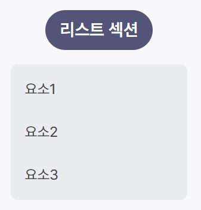

# 🧩 컴포넌트 가이드 - ListSection

> 타이틀과 `ul` 리스트를 포함하는 섹션 컴포넌트.



### 설명

- 리스트 섹션 UI에 재사용 가능한 structure 컴포넌트
- `children` 에 `li` 로 이루어진 자식 노드 삽입하여 사용
- 기본 스타일 포함

### 기본 사용법

```jsx
import ListSection from "@/components/ListSection/ListSection.jsx";

<ListSection title="리스트 섹션">
  <li>...</li>
  <li>...</li>
  <li>...</li>
</ListSection>;
```

### props

| 속성명     | 타입   | 설명                      | 기본값 |
| ---------- | ------ | ------------------------- | ------ |
| `title`    | string | 리스트 제목 텍스트(h2)    | -      |
| `children` | object | 리스트 자식 요소 노드(li) | -      |
