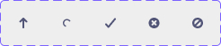

# 🧩 **컴포넌트 가이드 - SvgIcon**

> 다양한 아이콘 `svg` 를 일관된 방식으로 렌더링하는 컴포넌트.



### 설명

- 크기, 색상 커스터마이징 가능
- 인라인 스타일, 클래스명 등 기본 HTML 속성 지원
- 접근성 label 커스터마이징 지원

### 기본 사용법

```jsx
import SvgIcon from '@/components/SvgIcon/SvgIcon.jsx';

// 기본 아이콘 (위쪽 화살표)
<SvgIcon />

// 특정 타입의 아이콘
<SvgIcon type='spinner' />

// 크기와 색상 지정
<SvgIcon type='cross' size={32} color="#FF0000" />

// 접근성 레이블 추가
<SvgIcon type='check-mark' label="완료" />
```

### props

| 속성명     | 타입   | 설명                                                                   | 기본값     |
| ---------- | ------ | ---------------------------------------------------------------------- | ---------- |
| `type`     | string | 아이콘의 모양을 결정하는 이름                                          | ‘up-arrow’ |
| `size`     | number | 아이콘 가로, 세로 크기(px)                                             | 24         |
| `color`    | string | 아이콘 색상                                                            | ‘#525577’  |
| `label`    | string | 접근성 라벨                                                            | ‘ ‘        |
| `...props` | object | 추가적인 HTML 속성 지정, `<svg>`에 할당<br>(ex. `className` , `style`) | -          |

### 지원하는 아이콘 모양(type)

| type        | 설명                     |
| ----------- | ------------------------ |
| up-arrow    | 위를 가리키는 화살표     |
| spinner     | 로딩 스피너(+애니메이션) |
| check-mark  | 체크 마크                |
| cross       | X 마크                   |
| not-allowed | 금지 마크                |
