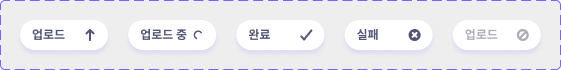

# 🧩 **컴포넌트 가이드 - UploadButton**

> 파일 업로드 상태를 시각적으로 전달하는 버튼 컴포넌트.



### 설명

- 상태(status)에 따른 아이콘 지원
- `children` 으로 삽입한 문자가 버튼 텍스트로 렌더링
- 접근성 label, title 툴팁 커스텀 지원
- `disabled` 버튼 기능 지원
- `SvgIcon` 컴포넌트 포함

### 기본 사용법

```jsx
import UploadButton from '@/components/UploadButton/UploadButton.jsx';

// 기본 상태 (대기)
<UploadButton>업로드</UploadButton>

// 특정 타입의 아이콘
<UploadButton></UploadButton>

// 크기와 색상 지정
<UploadButton></UploadButton>

// 비활성화 버튼
<UploadButton></UploadButton>
```

### props

| 속성명     | 타입             | 설명                                                                      | 기본값    |
| ---------- | ---------------- | ------------------------------------------------------------------------- | --------- |
| `status`   | string           | 버튼 상태(아이콘) 종류 설정                                               | ‘idle’    |
| `lang`     | string           | 버튼 언어 코드                                                            | ‘ko’      |
| `label`    | string           | 스크린리더 레이블+툴팁 적용 텍스트                                        | ‘ ’       |
| `color`    | string           | 버튼 텍스트/아이콘 색상                                                   | ‘#525577’ |
| `size`     | number           | 버튼 텍스트/아이콘 크기(px)                                               | 12        |
| `children` | string \| object | 버튼 텍스트 or 자식 DOM 노드                                              | ‘업로드’  |
| `…props`   | object           | 추가적인 HTML 속성 지정, `<button>`에 할당<br>(ex. `className` , `style`) | -         |

### 지원하는 버튼 상태(status)

| status   | 설명                         | 비고                                       |
| -------- | ---------------------------- | ------------------------------------------ |
| idle     | 대기(up-arrow 아이콘)        |                                            |
| pending  | 로딩(spinner 아이콘)         | 스피너 애니메이션 포함                     |
| resolved | 성공(check-mark 아이콘)      |                                            |
| rejected | 실패(cross 아이콘)           |                                            |
| disabled | 비활성화(not-allowed 아이콘) | `disabled` 속성 활성화, 색상 고정(#ADAEB6) |
